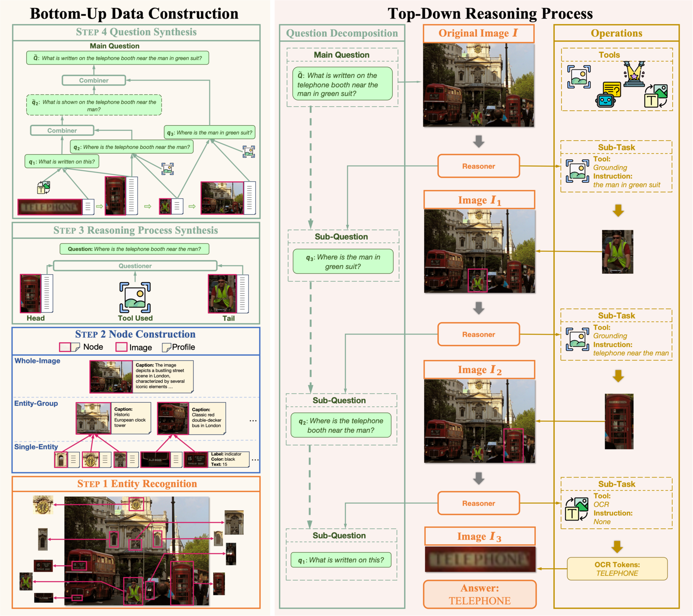

# VisualReasoner

Official repository for the EMNLP 2024 paper ["From the Least to the Most: Building a Plug-and-Play Visual Reasoner via Data Synthesis"](https://arxiv.org/abs/2406.19934)



---

## :gear: Setup

```bash
git clone https://github.com/steven-ccq/VisualReasoner.git
cd VisualReasoner
```

### Environment

```bash
# Python 3.8
pip install -r requirements.txt
```

### Grounding DINO

```bash
cd tools
git clone https://github.com/AntResearchNLP/VisualReasoner.git
cd GroundingDINO/
pip install -e .
mkdir weights
cd weights
wget -q https://github.com/IDEA-Research/GroundingDINO/releases/download/v0.1.0-alpha/groundingdino_swint_ogc.pth
cd ..
```

### Planner Model

Download the [adapter](https://drive.google.com/file/d/1NJpQuvMr2JS56j2qCZFOJ2L9QKeqOc8A/view?usp=sharing).

Merge it with [llava-1.5-7b-hf](https://huggingface.co/llava-hf/llava-1.5-7b-hf) to obtain the Planner model.

Rename the Planner model as `planner` and move it into `models/`.

## :rocket: Inference

First, download the corresponding test sets as guided in the `data/` directory.

To facilitate usage, we have provided scripts for each test task:

```bash
# TextVQA
bash textvqa.sh
# TallyQA
bash tallyqa.sh
# ST-VQA
bash stvqa.sh
# GQA
bash gqa.sh
```

The parameters used in the scripts are described in the table below:

| Argument        | Description                         |
|-----------------|-------------------------------------|
| `input`         | Path to the input file              |
| `output`        | Path to the output file             |
| `vlm_module`    | Path to the Answer model            |
| `src`           | Path to the image folder            |
| `model`         | Path to the Planner model           |
| `grounding_basedir` | Path to the Grounding DINO    |

---

## :dart: Evaluation

```bash
# TextVQA
python eval/eval_textvqa.py --input=textvqa.json
# TallyQA
python eval/eval_tallyqa.py --input=tallyqa.json
# ST-VQA
https://rrc.cvc.uab.es/?ch=11
# GQA
python eval/eval_gqa.py --input=gqa.json
```

## :balloon: Data

We also provide a 1M dataset synthesized using the least-to-most method. You can access this dataset through 🤗[VisualReasoner-1M](https://huggingface.co/datasets/orange-sk/VisualReasoner-1M). We also release a variant of this dataset, which contains 30k end-to-end reasoning processes. You can access this dataset through 🤗[VisualReasoner-30k](https://huggingface.co/datasets/orange-sk/VisualReasoner-30k).


```text
@inproceedings{cheng-etal-2024-least,
    title = "From the Least to the Most: Building a Plug-and-Play Visual Reasoner via Data Synthesis",
    author = "Cheng, Chuanqi  and
      Guan, Jian  and
      Wu, Wei  and
      Yan, Rui",
    editor = "Al-Onaizan, Yaser  and
      Bansal, Mohit  and
      Chen, Yun-Nung",
    booktitle = "Proceedings of the 2024 Conference on Empirical Methods in Natural Language Processing",
    month = nov,
    year = "2024",
    address = "Miami, Florida, USA",
    publisher = "Association for Computational Linguistics",
    url = "https://aclanthology.org/2024.emnlp-main.284/",
    doi = "10.18653/v1/2024.emnlp-main.284",
    pages = "4941--4957",
    abstract = "We explore multi-step reasoning in vision-language models (VLMs). The problem is challenging, as reasoning data consisting of multiple steps of visual and language processing are barely available. To overcome the challenge, we first introduce a least-to-most visual reasoning paradigm, which interleaves steps of decomposing a question into sub-questions and invoking external tools for resolving sub-questions. Based on the paradigm, we further propose a novel data synthesis approach that can automatically create questions and multi-step reasoning paths for an image in a bottom-up manner. Our approach divides the complex synthesis task into a few simple sub-tasks, and (almost entirely) relies on open-sourced models to accomplish the sub-tasks. Therefore, the entire synthesis process is reproducible and cost-efficient, and the synthesized data is quality guaranteed. With the approach, we construct 50k visual reasoning examples. Then, we develop a visual reasoner through supervised fine-tuning, which is capable of generally enhancing the reasoning abilities of a wide range of existing VLMs in a plug-and-play fashion. Extensive experiments indicate that the visual reasoner can consistently and significantly improve four VLMs on four VQA benchmarks."
}
```
